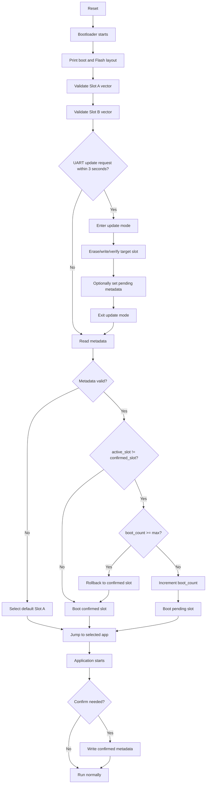

# Project 04 — STM32 Dual-Slot UART OTA Bootloader

`04_uart_bootloader` is a practical STM32 bootloader project that implements a dual-slot A/B firmware update flow over UART.

The bootloader lives in a fixed Flash region, validates Slot A and Slot B vector tables, receives firmware packets from a Python host tool, writes the target slot, and uses metadata to boot a new image in a pending state. The application confirms itself after a successful boot, allowing the bootloader to keep or roll back the update.

This project was built and tested on a NUCLEO-G0B1RE board. The included evidence logs show the full update flow for both Slot A and Slot B.

---

## 1. Final Status

Completed features:

- Fixed bootloader region
- Independent Slot A and Slot B application builds
- Slot vector table validation
- Wrong-slot binary rejection
- UART update mode with command parser
- Flash erase / write / verify operations
- Packet-based UART firmware transfer
- Per-packet CRC32 validation
- Python host updater using `pyserial`
- Metadata-based active / confirmed / pending state
- Pending boot count update
- Application self-confirmation
- Rollback to the last confirmed slot
- Generic update target: Slot A or Slot B

Final verified flow:

```txt
Host PC
  -> enter UART update mode
  -> erase target slot
  -> send firmware as CRC-protected packets
  -> set target slot as pending
  -> bootloader boots pending image
  -> application confirms itself
  -> next reset boots confirmed image
```

---

## 2. Hardware and Tools

| Item | Value |
|---|---|
| Board | NUCLEO-G0B1RE |
| MCU | STM32G0B1RE |
| Flash | 512 KB |
| SRAM | 144 KB |
| IDE | STM32CubeIDE |
| Programmer | STM32CubeProgrammer CLI |
| Debug / update UART | USART2 |
| UART pins | PA2 TX, PA3 RX |
| Baudrate | 115200 |
| LED | PA5 `LED_GREEN` |
| Host updater | Python 3 + `pyserial` |
| Optional console UI | `rich` |

---

## 3. Repository Structure

```txt
04_uart_bootloader/
├── bootloader/
│   ├── Core/
│   │   ├── Inc/
│   │   │   ├── bl_image.h
│   │   │   ├── bl_log.h
│   │   │   ├── bl_main.h
│   │   │   ├── bl_metadata.h
│   │   │   ├── bl_slot.h
│   │   │   └── bl_update.h
│   │   └── Src/
│   │       ├── bl_image.c
│   │       ├── bl_log.c
│   │       ├── bl_main.c
│   │       ├── bl_metadata.c
│   │       ├── bl_slot.c
│   │       └── bl_update.c
│   ├── bootloader.ioc
│   └── STM32G0B1RETX_FLASH.ld
│
├── app/
│   ├── Core/
│   │   ├── Inc/
│   │   │   ├── app_log.h
│   │   │   ├── app_main.h
│   │   │   └── app_metadata.h
│   │   └── Src/
│   │       ├── app_log.c
│   │       ├── app_main.c
│   │       └── app_metadata.c
│   ├── linker/
│   │   ├── STM32G0B1RETX_SLOT_A.ld
│   │   └── STM32G0B1RETX_SLOT_B.ld
│   └── app.ioc
│
├── common/
│   ├── bl_flash_layout.h
│   └── bl_metadata_format.h
│
├── tools/
│   ├── build_all.bat
│   ├── flash_all.bat
│   ├── uart_packet_sender.py
│   ├── ota_slot_a_m23.bat
│   ├── ota_slot_b_m23.bat
│   ├── ota_slot_b_m21.bat
│   ├── send_app_slot_b_m20.bat
│   ├── send_test_packet_m19.bat
│   ├── generate_metadata.py
│   └── generate_test_packet.py
│
├── BUILD_SETUP.md
└── README.md
```

Evidence logs are stored separately, normally under:

```txt
assets/logs/04_uart_bootloader/
```

or exported as:

```txt
04_uart_bootloader-logs.zip
```

---

## 4. Flash Layout

The Flash layout is defined in:

```txt
common/bl_flash_layout.h
```

```txt
STM32G0B1RE Flash: 512 KB

0x08000000 - 0x0800FFFF : Bootloader       64 KB
0x08010000 - 0x0803FFFF : Slot A           192 KB
0x08040000 - 0x0806FFFF : Slot B           192 KB
0x08070000 - 0x0807EFFF : Reserved         60 KB
0x0807F000 - 0x0807F7FF : Metadata Page 0  2 KB
0x0807F800 - 0x0807FFFF : Metadata Page 1  2 KB
```

Important constants:

```c
#define BL_BOOT_BASE_ADDR       0x08000000UL
#define BL_BOOT_SIZE            (64UL * 1024UL)

#define BL_SLOT_A_BASE_ADDR     0x08010000UL
#define BL_SLOT_B_BASE_ADDR     0x08040000UL
#define BL_SLOT_SIZE            (192UL * 1024UL)

#define BL_METADATA0_BASE_ADDR  0x0807F000UL
#define BL_METADATA1_BASE_ADDR  0x0807F800UL
#define BL_METADATA_PAGE_SIZE   2048UL

#define BL_SRAM_BASE_ADDR       0x20000000UL
#define BL_SRAM_SIZE            (144UL * 1024UL)
#define BL_SRAM_LIMIT_ADDR      0x20024000UL
```

Metadata Page 0 is used by the current implementation. Metadata Page 1 is reserved for future redundancy or wear-leveling work.

---

## 5. Application Slot Builds

The same application source is built twice with different linker settings.

### Slot A

| Item | Value |
|---|---|
| Build config | `SlotA_Release` |
| Output binary | `app/SlotA_Release/app_slot_a.bin` |
| Flash origin | `0x08010000` |
| Flash length | `192K` |
| Required define | `APP_SLOT_A` |
| VTOR offset | `VECT_TAB_OFFSET=0x00010000U` |
| Expected vector table | `0x08010000` |

### Slot B

| Item | Value |
|---|---|
| Build config | `SlotB_Release` |
| Output binary | `app/SlotB_Release/app_slot_b.bin` |
| Flash origin | `0x08040000` |
| Flash length | `192K` |
| Required define | `APP_SLOT_B` |
| VTOR offset | `VECT_TAB_OFFSET=0x00040000U` |
| Expected vector table | `0x08040000` |

The Slot A and Slot B binaries are not interchangeable. A Slot A binary written to Slot B must fail Slot B vector validation because its reset handler still points into the Slot A address range.

---

## 6. Bootloader Modules

| Module | Role |
|---|---|
| `bl_main.c` | Main boot flow, metadata decision, pending/rollback handling, jump to app |
| `bl_image.c` | Vector table validation and application jump |
| `bl_slot.c` | Flash erase/write/verify for Slot A and Slot B |
| `bl_metadata.c` | Metadata read/write and CRC validation |
| `bl_update.c` | UART update mode and command dispatcher |
| `bl_log.c` | UART log output |

The bootloader keeps `main.c` thin. The main application logic is placed in bootloader modules instead of Cube-generated files.

---

## 7. Application Modules

| Module | Role |
|---|---|
| `app_main.c` | Test application boot log, VTOR check, metadata confirmation |
| `app_metadata.c` | App-side metadata read/write/CRC logic |
| `app_log.c` | UART log output |

When the app boots from a pending slot, it confirms itself by writing:

```txt
active_slot    = current app slot
confirmed_slot = current app slot
boot_count     = 0
```

---

## 8. Metadata Format

The shared metadata format is defined in:

```txt
common/bl_metadata_format.h
```

```c
typedef struct
{
  uint32_t magic;
  uint32_t version;
  uint32_t active_slot;
  uint32_t confirmed_slot;
  uint32_t boot_count;
  uint32_t reserved[3];
  uint32_t crc32;
} BlMetadata_t;
```

Constants:

```c
#define BL_METADATA_MAGIC    0x424C4D44UL   /* "BLMD" */
#define BL_METADATA_VERSION  1UL
#define BL_METADATA_SLOT_A   0x00000041UL   /* 'A' */
#define BL_METADATA_SLOT_B   0x00000042UL   /* 'B' */
```

Typical states:

### No valid metadata

```txt
metadata_magic=NG
use_default_slot=A
```

### Confirmed Slot A

```txt
active_slot=A
confirmed_slot=A
boot_count=0
update_state=CONFIRMED
```

### Pending Slot B

```txt
active_slot=B
confirmed_slot=A
boot_count=0 or 1 or 2
update_state=PENDING
```

### Confirmed Slot B

```txt
active_slot=B
confirmed_slot=B
boot_count=0
update_state=CONFIRMED
```

---

## 9. Boot Flow



---

## 10. Vector Validation

Before jumping to an application, the bootloader validates the vector table.

Checks:

- Initial MSP is inside SRAM range
- Reset handler has Thumb bit set
- Reset handler address is inside the selected slot range

Example valid Slot B vector:

```txt
[BOOT] validate_slot=B
[BOOT] slot_base=0x08040000
[BOOT] slot_end=0x0806FFFF
[BOOT] initial_msp=0x20024000
[BOOT] reset_handler_raw=0x08040DBD
[BOOT] reset_handler_addr=0x08040DBC
[BOOT] msp_check=OK
[BOOT] reset_thumb_check=OK
[BOOT] reset_range_check=OK
[BOOT] vector_check=OK
[TEST5] slot_b_vector_check PASS
```

Wrong-slot example: Slot A binary written into Slot B must fail because its reset handler points back into Slot A.

```txt
[BOOT] reset_handler_raw=0x08010A49
[BOOT] reset_handler_addr=0x08010A48
[BOOT] reset_range_check=NG
[BOOT] vector_check=NG
[BOOT] reject_reason=reset_handler_points_to_slot_a
[TEST6] wrong_slot_b_reject_check PASS
```

---

## 11. UART Update Mode

At boot, the bootloader waits for `u` or `U` for 3 seconds.

```txt
[BOOT] uart_update_window=3000ms
[BOOT] send_u_to_enter_update_mode
```

If the host sends `u`, the bootloader enters update mode:

```txt
[BOOT] uart_update_request=YES
[BOOT] update_mode=ENTER
[TEST14] uart_update_mode_entry_check PASS
```

Available commands:

```txt
help
info
erase a
erase b
write-test a
write-test b
rx-packet a
rx-packet b
set-pending a
set-pending b
exit
reboot
```

Command summary:

| Command | Description |
|---|---|
| `help` | Print command list |
| `info` | Print bootloader, slot and metadata addresses |
| `erase a` / `erase b` | Erase selected application slot |
| `write-test a` / `write-test b` | Write a 16-byte test pattern to selected slot and verify it |
| `rx-packet a` / `rx-packet b` | Receive one binary packet and write it to selected slot |
| `set-pending a` / `set-pending b` | Set selected slot as pending boot image |
| `exit` | Leave update mode and continue normal boot |
| `reboot` | Reset the MCU |

---

## 12. UART Packet Format

The host sends firmware data using a simple binary packet format.

```txt
Offset  Size  Field
0       4     magic
4       4     slot offset
8       4     payload length
12      4     payload CRC32
16      N     payload
```

Packet constants:

```c
#define BL_UPDATE_PACKET_MAGIC        0x31544B50UL  /* "PKT1" */
#define BL_UPDATE_PACKET_HEADER_SIZE  16U
#define BL_UPDATE_PACKET_MAX_PAYLOAD  256U
```

Each packet is checked for:

- Magic value
- Payload length
- 8-byte alignment
- CRC32 match
- Flash write result
- Flash verify result

Example log:

```txt
[UPDATE] rx_packet_slot=B
[UPDATE] packet_offset=0x00000100
[UPDATE] packet_length=256
[UPDATE] packet_crc_stored=0x8F1C0C9D
[UPDATE] packet_crc_calculated=0x8F1C0C9D
[UPDATE] packet_crc_check=OK
[UPDATE] rx_packet_write=OK
[UPDATE] rx_packet_verify=OK
[TEST18] uart_binary_packet_receive_check PASS
```

Important implementation detail: after receiving the 16-byte header, the bootloader reads the payload immediately before printing long logs. This avoids losing payload bytes when the host sends the full packet continuously.

---

## 13. Python Host Updater

Host tool:

```txt
tools/uart_packet_sender.py
```

Dependencies:

```bat
py -3 -m pip install pyserial rich
```

Main options:

| Option | Description |
|---|---|
| `--port COM3` | UART COM port |
| `--baud 115200` | UART baudrate |
| `--file <bin>` | Firmware binary to send |
| `--target a` | Update Slot A |
| `--target b` | Update Slot B |
| `--set-pending` | Write pending metadata after upload |
| `--make-test-file` | Generate an ASCII test file before sending |
| `--test-size 1024` | Size of generated test file |
| `--quiet-serial` | Hide raw bootloader UART log |

Example: send test data to Slot B:

```bat
cd firmware\04_uart_bootloader\tools
py -3 uart_packet_sender.py --port COM3 --file generated\uart_multi_packet_test_slot_b.bin --make-test-file --test-size 1024 --target b
```

Example: full OTA to Slot B:

```bat
cd firmware\04_uart_bootloader\tools
py -3 uart_packet_sender.py --port COM3 --file ..\app\SlotB_Release\app_slot_b.bin --target b --set-pending
```

Example: full OTA to Slot A:

```bat
cd firmware\04_uart_bootloader\tools
py -3 uart_packet_sender.py --port COM3 --file ..\app\SlotA_Release\app_slot_a.bin --target a --set-pending
```

The tool sends command characters with a small delay. This avoids UART receive overrun because the bootloader echoes command characters with blocking UART transmit.

---

## 14. Batch Scripts

| Script | Purpose |
|---|---|
| `tools/build_all.bat` | Build bootloader, Slot A app and Slot B app using STM32CubeIDE CLI |
| `tools/flash_all.bat` | Full SWD flash: bootloader + Slot A + Slot B |
| `tools/send_test_packet_m19.bat` | Generate and send a 1024-byte test file to Slot B |
| `tools/send_app_slot_b_m20.bat` | Send real `app_slot_b.bin` to Slot B without setting pending metadata |
| `tools/ota_slot_b_m21.bat` | Older fixed Slot B OTA flow |
| `tools/ota_slot_b_m23.bat` | Generic target flow for full OTA to Slot B |
| `tools/ota_slot_a_m23.bat` | Generic target flow for full OTA to Slot A |

Safety note for `ota_slot_a_m23.bat`: only run it after Slot B is already confirmed. If Slot A update fails, the bootloader can then roll back to Slot B.

---

## 15. Build

The build script expects STM32CubeIDE CLI at:

```bat
C:\ST\STM32CubeIDE_1.18.0\STM32CubeIDE\stm32cubeidec.exe
```

Edit `tools/build_all.bat` if your STM32CubeIDE is installed elsewhere.

Run:

```bat
cd firmware\04_uart_bootloader\tools
build_all.bat
```

Expected outputs:

```txt
bootloader/Release/bootloader.bin
app/SlotA_Release/app_slot_a.bin
app/SlotB_Release/app_slot_b.bin
```

From the current evidence package:

| Binary | Size |
|---|---:|
| `bootloader.bin` | 22068 bytes |
| `app_slot_a.bin` | 12912 bytes |
| `app_slot_b.bin` | 12912 bytes |

---

## 16. Flash Initial Image by SWD

Run:

```bat
cd firmware\04_uart_bootloader\tools
flash_all.bat
```

The script writes:

```txt
bootloader.bin  -> 0x08000000
app_slot_a.bin  -> 0x08010000
app_slot_b.bin  -> 0x08040000
```

Expected first boot checks:

```txt
[TEST0] bootloader_boot_check PASS
[TEST1] flash_layout_check PASS
[TEST4] slot_a_vector_check PASS
[TEST5] slot_b_vector_check PASS
```

---

## 17. Full OTA Flow: Slot A to Slot B

Run:

```bat
cd firmware\04_uart_bootloader\tools
ota_slot_b_m23.bat
```

What the script does:

```txt
1. Enter update mode
2. erase b
3. Send app_slot_b.bin as 51 packets
4. set-pending b
5. exit
```

Expected upload result:

```txt
[TEST14] uart_update_mode_entry_check PASS
[TEST16] slot_erase_command_check PASS
[TEST18] uart_binary_packet_receive_check PASS
[TEST19] set_pending_command_check PASS
```

Expected pending boot:

```txt
[BOOT] active_slot=B
[BOOT] confirmed_slot=A
[BOOT] update_state=PENDING
[TEST9] pending_metadata_check PASS
[TEST12] pending_boot_count_update_check PASS
[BOOT] selected_slot=B
```

Expected app confirmation:

```txt
[APP] slot_name=B
[APP] confirm_required=YES
[APP] confirm_metadata_write=OK
[TEST13] app_confirm_image_check PASS
```

After one more reset:

```txt
[BOOT] active_slot=B
[BOOT] confirmed_slot=B
[BOOT] update_state=CONFIRMED
[BOOT] selected_slot=B
[APP] slot_name=B
[APP] confirm_required=NO
```

---

## 18. Full OTA Flow: Slot B to Slot A

Run only after Slot B is confirmed.

```bat
cd firmware\04_uart_bootloader\tools
ota_slot_a_m23.bat
```

What the script does:

```txt
1. Enter update mode
2. erase a
3. Send app_slot_a.bin as 51 packets
4. set-pending a
5. exit
```

Expected pending boot:

```txt
[BOOT] active_slot=A
[BOOT] confirmed_slot=B
[BOOT] update_state=PENDING
[TEST9] pending_metadata_check PASS
[TEST12] pending_boot_count_update_check PASS
[BOOT] selected_slot=A
```

Expected confirmed state after application confirmation and reset:

```txt
[BOOT] active_slot=A
[BOOT] confirmed_slot=A
[BOOT] update_state=CONFIRMED
[BOOT] selected_slot=A
[APP] slot_name=A
[TEST13] app_confirm_image_check PASS
```

---

## 19. Rollback Behavior

If the active slot is pending but does not confirm itself, the bootloader increments `boot_count` before jumping to it.

When `boot_count >= 3`, rollback is triggered.

Example rollback metadata:

```txt
active_slot=B
confirmed_slot=A
boot_count=3
```

Expected bootloader result:

```txt
[BOOT] update_state=PENDING
[BOOT] rollback_required=YES
[TEST10] rollback_decision_check PASS
[BOOT] rollback_to_slot=A
[BOOT] rollback_metadata_write=OK
[TEST11] rollback_metadata_write_check PASS
[BOOT] selected_slot=A
```

---

## 20. Test Milestones

| Test | Description | Evidence |
|---|---|---|
| TEST0 | Bootloader VTOR check | `boot_log.txt` |
| TEST1 | Flash layout check | `boot_log.txt` |
| TEST2 | Slot A app boot check | `app_slot_a_boot_log.txt`, `boot_slot_a_confirm_log.txt` |
| TEST3 | Slot B app boot check | `app_slot_b_boot_log.txt`, `boot_slot_b_confirm_log.txt` |
| TEST4 | Slot A vector check | `flash_all_log.txt` |
| TEST5 | Slot B vector check | `slot_b_real_app_vector_pass_log.txt` |
| TEST6 | Wrong-slot binary rejection | `wrong_slot_b_reject_log.txt` |
| TEST7 | Metadata read/default fallback | `metadata_empty_fallback_log.txt` |
| TEST8 | Metadata CRC check | `metadata_crc_slot_b_boot_log.txt` |
| TEST9 | Pending metadata check | `metadata_pending_b_boot_log.txt`, `ota_target_a_log.txt`, `ota_target_b_log.txt` |
| TEST10 | Rollback decision | `metadata_rollback_to_a_log.txt` |
| TEST11 | Rollback metadata write | `rollback_metadata_write_log.txt` |
| TEST12 | Pending boot count update | `pending_boot_count_auto_rollback_log.txt`, `ota_target_a_log.txt`, `ota_target_b_log.txt` |
| TEST13 | App self-confirmation | `app_confirm_slot_b_log.txt`, `boot_slot_a_confirm_log.txt`, `boot_slot_b_confirm_log.txt` |
| TEST14 | UART update mode entry | `uart_update_mode_entry_log.txt` |
| TEST15 | UART command parser | `uart_command_parser_log.txt` |
| TEST16 | Slot erase command | `uart_erase_slot_b_command_log.txt`, `ota_target_a_log.txt`, `ota_target_b_log.txt` |
| TEST17 | Slot write-test command | `uart_write_test_slot_b_log.txt` |
| TEST18 | UART binary packet receive | `uart_binary_packet_receive_log.txt`, `uart_multi_packet_sender_log.txt`, `ota_target_a_log.txt`, `ota_target_b_log.txt` |
| TEST19 | Set pending command | `ota_target_a_log.txt`, `ota_target_b_log.txt` |

---

## 21. Evidence Log Index

Important evidence logs:

```txt
boot_log.txt
flash_all_log.txt
wrong_slot_b_reject_log.txt
metadata_empty_fallback_log.txt
metadata_crc_slot_b_boot_log.txt
metadata_pending_b_boot_log.txt
metadata_rollback_to_a_log.txt
rollback_metadata_write_log.txt
rollback_metadata_persist_after_reset_log.txt
uart_update_mode_entry_log.txt
uart_update_window_normal_boot_log.txt
uart_command_parser_log.txt
uart_erase_slot_b_command_log.txt
uart_write_test_slot_b_log.txt
uart_binary_packet_receive_log.txt
uart_multi_packet_sender_log.txt
send_app_slot_b_m20_log.txt
slot_b_real_app_vector_pass_log.txt
ota_slot_b_m21_log.txt
ota_target_b_log.txt
ota_target_a_log.txt
boot_slot_b_confirm_log.txt
boot_slot_a_confirm_log.txt
```

These logs are useful for writing a blog post or portfolio article because they show not only success paths, but also rejection, pending state, rollback, and final confirmation states.

---

## 22. Safety Notes

- Do not erase the only valid confirmed slot unless the other slot is already valid and confirmed.
- `ota_slot_a_m23.bat` should be used only after Slot B is confirmed.
- Slot A and Slot B binaries must be built with their own linker scripts.
- The bootloader validates the target slot before setting it as pending.
- The bootloader also checks the rollback slot and prints a warning if it is invalid.
- The current metadata implementation writes Metadata Page 0 only.
- The project does not implement cryptographic signature verification.
- The project does not implement encryption.
- The project does not implement production-grade anti-rollback version control.
- The project does not claim power-cut-safe metadata redundancy.

---

## 23. Known Limitations and Future Work

Possible future improvements:

- Use both metadata pages for redundancy and power-cut recovery
- Add image-level CRC for the entire firmware image, not only per-packet CRC
- Add firmware version field and anti-rollback policy
- Add cryptographic signature verification
- Add encrypted payload support
- Add automatic inactive-slot selection in the Python updater
- Increase packet payload size from 256 bytes to 512 or 1024 bytes
- Move Flash critical routines to RAM if continuous same-bank operation is required
- Add a cleaner binary protocol with ACK/NACK codes instead of log-token parsing

---

## 24. Summary

This project demonstrates a complete educational A/B UART bootloader flow on STM32:

```txt
Dual-slot layout
UART firmware transfer
CRC-protected packets
Flash erase/write/verify
Metadata pending/confirmed state
Application self-confirmation
Rollback support
Generic update target A/B
```

The final milestone proves that the board can update from Slot A to Slot B and then from Slot B back to Slot A using the same generic UART update mechanism.
